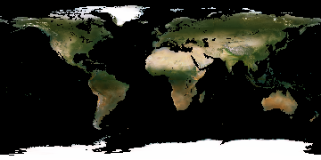
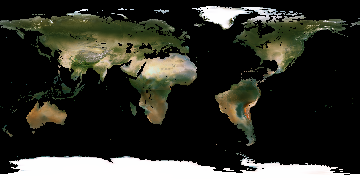

# AI Climate Drawer

An AI tool based on multivariate neural networks. The UI contains a tool for drawing elevation maps and sending them to be processed, where the climate is naively predicted and the AI renders the imagined satellite view of the planet in equirectangular projection.

Created using Python (numpy, matplotlib, pytorch, flask), Javascript, and HTMl/CSS.

Made for Hack the MIST 2023 by Edwin Chen and Richard Yin.

Here is the model when fitted to the original data of Earth and also to retrograde Earth:

 

